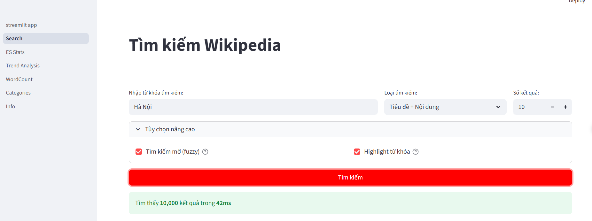
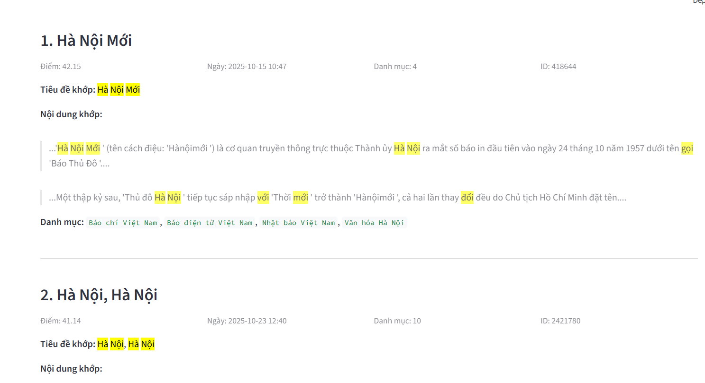
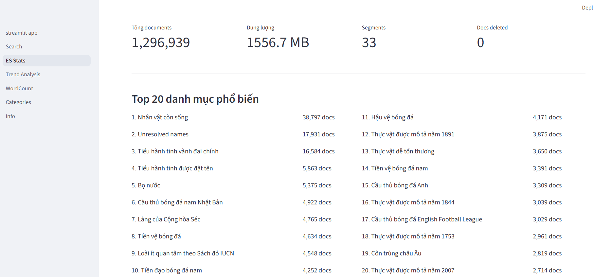
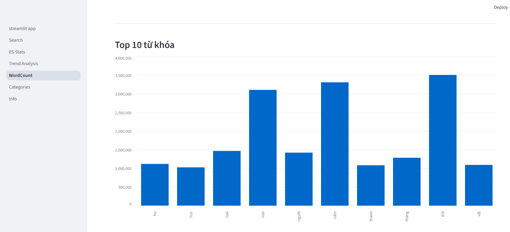
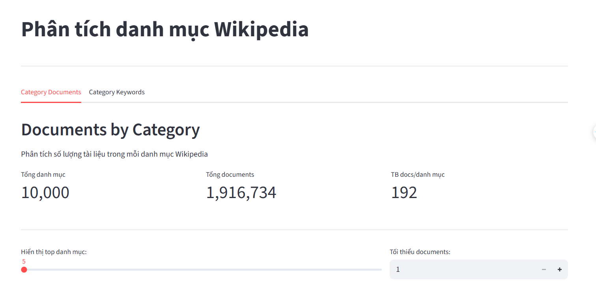

# Vietnamese Wikipedia Search System

A Big Data university project that delivers full-text search and analytical dashboards for Vietnamese Wikipedia data.  
The system combines **Hadoop MapReduce on HDFS** for large-scale processing and **Elasticsearch** for fast search/query, exposed through a **Streamlit multi-page web app**.

---

## Project Overview

This project ingests the Vietnamese Wikipedia XML dump, processes it with Hadoop MapReduce, and indexes results into Elasticsearch for interactive exploration.

- **Indexed documents:** `1,296,939`
- **Elasticsearch storage:** `1556.7 MB`
- **Frontend:** Streamlit multi-page application

---

## Tech Stack

- **Python** 3.10+
- **Hadoop + HDFS**
- **MapReduce Streaming**
- **Elasticsearch** 8.x
- **Streamlit**

---

## Dataset

- **Source:** Vietnamese Wikipedia dump (XML)
- **Indexed in Elasticsearch:** `1,296,939` documents
- **Index size:** `1556.7 MB`

---

## Features / Pages

### 1) Search
- Full-text search on title and content
- Fuzzy matching support
- Keyword highlighting in results
- Ranked output with relevance score
- Example performance: query **"Hà Nội"** returns **10,000 results in 42ms**

### 2) ES Stats
- Elasticsearch index statistics:
  - Total documents: `1,296,939`
  - Storage: `1556.7 MB`
  - Top 20 Wikipedia categories

### 3) Trend Analysis
- Keyword frequency trend over time

### 4) WordCount
- Top word-frequency table generated from MapReduce output

### 5) Categories
- Document count distribution by Wikipedia category

### 6) Info
- Architecture overview
- End-to-end workflow
- Cluster/service status

---

## System Architecture

Vietnamese Wikipedia XML dump  
→ **Hadoop MapReduce on HDFS** (cleaning, word count, trend aggregation)  
→ **Elasticsearch bulk indexing**  
→ **Streamlit multi-page frontend**

---

## Screenshots

### 1. Full-text search with fuzzy matching: 10,000 results in 42ms


### 2. Ranked results with highlighted keyword matches


### 3. Elasticsearch index statistics: 1.3M documents, 1556 MB


### 4. Word frequency analysis via MapReduce


### 5. Document distribution by Wikipedia category


---

## Important Notice

> [!WARNING]  
> This application requires a **locally running Elasticsearch cluster** and **Hadoop/HDFS** environment.  
> There is **no hosted demo** available.

---

## Installation & Run

### 1) Clone repository
```bash
git clone https://github.com/<your-username>/<your-repo>.git
cd <your-repo>
```

### 2) Create and activate virtual environment
```bash
python -m venv .venv
```

**Windows (PowerShell):**
```bash
.venv\Scripts\Activate.ps1
```

**Linux/macOS:**
```bash
source .venv/bin/activate
```

### 3) Install dependencies
```bash
pip install -r requirements.txt
```

### 4) Start Elasticsearch
Make sure your local Elasticsearch 8.x cluster is running before indexing or launching the app.

### 5) Run data pipeline
1. Execute Hadoop MapReduce jobs (cleaning, word count, trend/category aggregations)  
2. Run Elasticsearch indexing script  
3. Launch Streamlit app:

```bash
streamlit run streamlit_app.py
```

---

## Author

**Lỗ Anh Việt**  
Đại học Thủy Lợi — Big Data Course 2026

---

## License

**Academic use only**.
